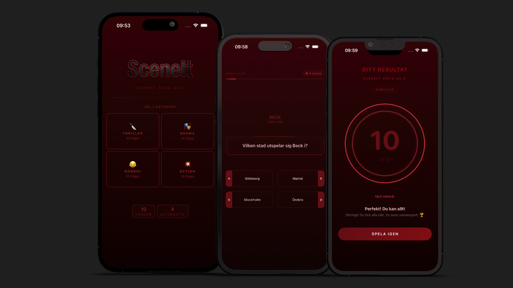
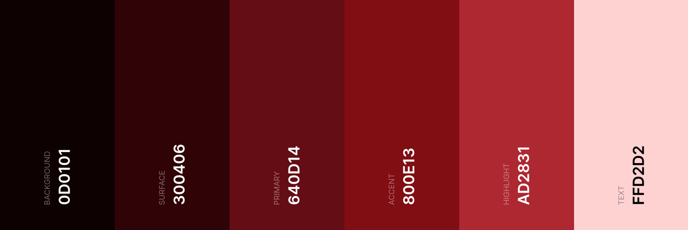
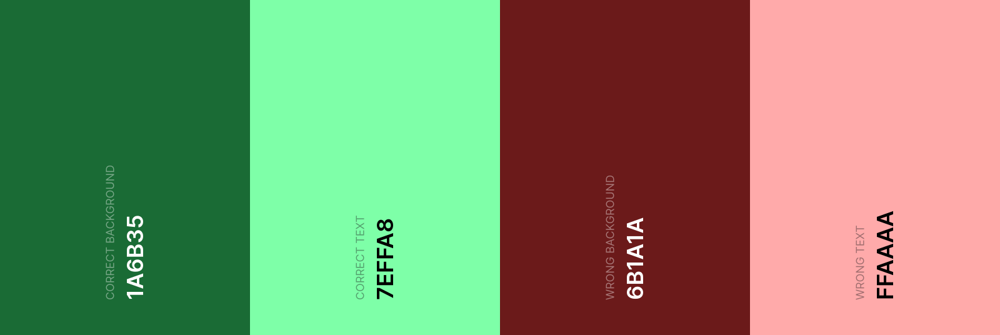

# SceneIt

## Table of Contents
- [UX](#ux)
  - [App Purpose](#app-purpose)
  - [App Goal](#app-goal)
  - [Developer Goals](#developer-goals)
  - [User Goals](#user-goals)
  - [Audience](#audience)
  - [Communication](#communication)
  - [Interaction & Experience Principles](#interaction--experience-principles)
- [Agile Planning](#agile-planning)
  - [Epics & User Stories](#epics--user-stories)
  - [Implemented User Stories](#implemented-user-stories)
  - [MoSCoW Prioritization](#moscow-prioritization)
  - [Kanban Board](#kanban-board)
- [Design](#design)
  - [Prototype](#prototype)
  - [Colour Scheme](#colour-scheme)
  - [Fonts](#fonts)
- [Features](#features)
  - [Existing Features](#existing-features)
  - [Future Features](#future-features)
- [Testing](#testing)
  - [Manual Testing](#manual-testing)
  - [Bugs](#bugs)
  - [Unfixed Bugs](#unfixed-bugs)
- [Technologies](#technologies)
  - [Main Languages Used](#main-languages-used)
  - [Architecture](#architecture)
  - [Setup & Installation](#setup--installation)
- [Credits](#credits)
  - [Content](#content)
  - [Media](#media)

## UX
### App Purpose
SceneIt is an interactive quiz app that puts Swedish TV series knowledge to the test. The app lets users challenge themselves across different genres — Comedy, Drama, Thriller, and Action — with questions about Swedish TV productions.

The purpose of the application is to offer an engaging and entertaining experience for Swedish TV series enthusiasts who want to explore and test their knowledge in a fun and visually appealing format.

### App Goal
The main goal of this project is to develop an entertaining and polished quiz application for iOS where users can:
- Choose a quiz category based on their interests
- Answer 10 questions per session with multiple-choice answers
- Receive immediate visual feedback on correct and incorrect answers
- See their final score with an animated result screen
- Track their personal best score per category

Additional goals include:
- Creating a visually engaging dark theme that fits the subject matter
- Ensuring smooth animations and transitions throughout the quiz flow
- Building a clean, intuitive interface with minimal learning curve

### Developer Goals
Our goal as developers is to build a stable, well-structured, and visually polished iOS application using modern Swift development practices.

We aim to:
- Apply the MVVM architecture pattern for a clean separation of concerns
- Use SwiftUI for declarative and maintainable UI development
- Maintain clean, readable, and well-documented code
- Collaborate efficiently using Git and agile methods

### User Goals
Quiz players want to:
- Quickly start a quiz in their preferred category
- Get clear and immediate feedback on their answers
- Track their personal best scores over time
- Enjoy a smooth and visually engaging experience

### Audience
SceneIt is aimed at anyone with an interest in Swedish TV series who enjoys testing their knowledge. Whether you are a casual viewer or a dedicated fan, the app offers a quick and entertaining quiz experience for all ages.

### Communication
The application communicates with users through clear visuals, consistent color-coded feedback, and simple navigation.

The quiz interface is designed to be visually engaging and easy to follow. Color feedback (green for correct, red for incorrect) provides instant clarity. Animated transitions and a progress bar keep the user oriented and motivated throughout the quiz.

The result screen delivers a clear summary of performance with an animated score visualization and a personal high score indicator to encourage repeat play.

### Interaction & Experience Principles
The application is designed to be intuitive, visually engaging, and immediately playable.

Key principles include:
- Minimal navigation — users go from category selection directly into the quiz
- Consistent visual language with a strong dark theme
- Instant answer feedback without interrupting the quiz flow
- Animations that enhance the experience without slowing it down
- A personal high score system to add replayability

[Back to top](#sceneit)

## Agile Planning
The development of SceneIt was planned using Agile methodology. All functionality was divided into Epics and refined into User Stories, each assigned a MoSCoW priority.

### Epics & User Stories

The project was structured using Agile principles, where all functionality was divided into epics and further refined into user stories. Each story represents a concrete piece of functionality from the user's perspective and guided both development and testing throughout the project. This ensured a clear scope, steady progress, and a predictable workflow from initial design to final implementation.

#### EPIC 1: Get Started
Covers the welcome screen and entry point into the quiz.

[View Epic 1](https://github.com/PatNoO/scene-it/issues/9)

*User Stories under this Epic:*
- [US 1: View Welcome Screen](https://github.com/PatNoO/scene-it/issues/1)

#### EPIC 2: Take the Quiz
Covers the core quiz interaction, answer feedback, and score tracking during the quiz.

[View Epic 2](https://github.com/PatNoO/scene-it/issues/10)

*User Stories under this Epic:*
- [US 2: View and Answer Questions](https://github.com/PatNoO/scene-it/issues/2)
- [US 3: View Correct/Incorrect Feedback](https://github.com/PatNoO/scene-it/issues/3)
- [US 4: View Progress and Score](https://github.com/PatNoO/scene-it/issues/4)

#### EPIC 3: Results
Covers the result screen, final score display, and navigation back to start.

[View Epic 3](https://github.com/PatNoO/scene-it/issues/11)

*User Stories under this Epic:*
- [US 5: View Final Result](https://github.com/PatNoO/scene-it/issues/5)

#### EPIC 4: Data Model
Covers the question data structure and loading of quiz content from the app bundle.

[View Epic 4](https://github.com/PatNoO/scene-it/issues/12)

*User Stories under this Epic:*
- [US 6: Quiz Data Loads Correctly](https://github.com/PatNoO/scene-it/issues/6)

#### EPIC 5: Enhanced Experience
Covers animations between questions and personal high score persistence.

[View Epic 5](https://github.com/PatNoO/scene-it/issues/13)

*User Stories under this Epic:*
- [US 7: Animations on Navigation](https://github.com/PatNoO/scene-it/issues/7)
- [US 8: Save High Score](https://github.com/PatNoO/scene-it/issues/8)

### Implemented User Stories

All planned user stories for this project were successfully implemented.

- [US 1: View Welcome Screen](https://github.com/PatNoO/scene-it/issues/1)
- [US 2: View and Answer Questions](https://github.com/PatNoO/scene-it/issues/2)
- [US 3: View Correct/Incorrect Feedback](https://github.com/PatNoO/scene-it/issues/3)
- [US 4: View Progress and Score](https://github.com/PatNoO/scene-it/issues/4)
- [US 5: View Final Result](https://github.com/PatNoO/scene-it/issues/5)
- [US 6: Quiz Data Loads Correctly](https://github.com/PatNoO/scene-it/issues/6)
- [US 7: Animations on Navigation](https://github.com/PatNoO/scene-it/issues/7)
- [US 8: Save High Score](https://github.com/PatNoO/scene-it/issues/8)

### MoSCoW Prioritization

| Priority        | Description                                                                                                                                      |
|-----------------|--------------------------------------------------------------------------------------------------------------------------------------------------|
| **Must Have**   | Core functionality required for the application to work, such as the welcome screen, quiz flow, answer feedback, result display, and data model. |
| **Should Have** | Important features that improve usability and replayability, such as progress tracking and score breakdown.                                      |
| **Could Have**  | Optional enhancements that polish the experience, such as animations and high score persistence.                                                 |
| **Won't Have**  | Features intentionally excluded from the current version to keep focus on a solid single-player offline MVP.                                     |

### Kanban Board
The project is organized using a [GitHub Projects Kanban board](https://github.com/users/PatNoO/projects/2) to manage and track progress throughout development.

Our workflow is structured as follows:

***Backlog → To Do → In Progress → Done***

User stories are first placed in the backlog and then moved to To Do when work begins. Tasks are then progressed through the board until they are completed.

This structure helps the team maintain transparency, organize work efficiently, and monitor progress throughout development.

[Back to top](#sceneit)

## Design
The visual design of SceneIt was developed with a focus on creating a strong dark atmosphere while ensuring a clean and engaging user experience. The design was inspired by AI-generated prototype images used as visual references during development.

### Prototype
Before development began, AI-generated images were used as design inspiration to establish the visual direction of the application. These served as references for layout, color mood, and overall aesthetic rather than strict blueprints. The final implementation evolved from these references during development.

### Colour Scheme
The application uses a dark color palette that complements the Swedish TV series quiz theme.

- **Background**: A deep dark tone creating an immersive atmosphere and reducing eye strain during extended play sessions.
- **Surface**: A slightly lighter dark tone used for cards and elevated elements, providing visual separation.
- **Primary**: The main brand color used for buttons, headings, and key interactive elements.
- **Accent**: A complementary color used alongside the primary color in gradients and highlights.
- **Highlight**: Used in the progress gradient to add visual depth.
- **Feedback Colors**:
  - Correct Answer: Green background and text for clear positive confirmation.
  - Incorrect Answer: Red background and text for immediate error indication.

*Main colour palette*

*Feedback colours*

### Fonts
The application uses the system default **SF Pro** typeface via SwiftUI's standard font system. Font sizes are standardized through a design constant system ranging from extra small to a large display size (100pt) used for the animated score on the result screen. This ensures consistent typography throughout the app and aligns with iOS platform conventions.

[Back to top](#sceneit)

## Features
The features of SceneIt are designed to provide an engaging and complete quiz experience with a focus on smooth interaction and visual polish.

### Existing Features
- **Category Selection**: Four quiz categories to choose from — Comedy, Thriller, Drama, and Action — each represented by a distinct category card on the start screen.
- **Quiz Flow**: 10 randomly ordered multiple-choice questions per session, each with four answer options.
- **Instant Answer Feedback**: Color-coded visual feedback (green/red) on answer buttons immediately after selection, with the correct answer always revealed.
- **Progress Tracking**: A gradient progress bar at the top of the quiz screen shows how far along the user is in the current session.
- **Smooth Transitions**: Slide animations between questions provide a polished and fluid experience.
- **Result Screen**: A dedicated results screen displaying the final score, number of correct answers, and a personalized feedback message.
- **Animated Score Visualization**: An animated ring graphic on the result screen visually represents the score percentage.
- **High Score Persistence**: Personal best scores are saved per category using UserDefaults and displayed as a badge on the result screen when a new record is set.
- **App Icon & Logo**: Custom app icon and SceneIt text logo on the start screen.
- **Language**: The app is in Swedish, matching the Swedish TV series content.

### Future Features
- **Expanded Question Bank**: More questions across existing and new categories.
- **Difficulty Levels**: Easy, medium, and hard tiers to cater to casual and hardcore quiz fans.
- **Timer Mode**: A countdown timer per question to add pressure and increase challenge.
- **Global Leaderboards**: Online high score boards to compete with other players.
- **Daily Challenges**: A new curated question set each day to encourage return visits.
- **Share Results**: Ability to share quiz results on social media.

[Back to top](#sceneit)

## Testing
Testing was performed throughout the development process to verify application stability and a smooth user experience. Extensive manual testing was conducted across all features and user flows.

### Manual Testing

| Feature Area | Description | Status |
| :--- | :--- | :---: |
| **Category Selection** | Verified that all four categories are displayed correctly and that tapping each card navigates to the correct quiz. | ✅ |
| **Quiz Flow** | Confirmed that questions load correctly, answer options display as expected, and the quiz progresses through all 10 questions. | ✅ |
| **Answer Feedback** | Tested that correct answers highlight green and incorrect answers highlight red immediately after selection, with the correct answer always revealed. | ✅ |
| **Progress Bar** | Verified that the progress bar updates correctly after each question and reflects the current position in the quiz. | ✅ |
| **Result Screen** | Confirmed that the final score, correct answer count, and personalized message are displayed accurately after completing a quiz. | ✅ |
| **Score Animation** | Verified that the animated score ring renders and animates correctly on the result screen. | ✅ |
| **High Score Persistence** | Tested that personal best scores are saved correctly per category and persist between app sessions. Confirmed that a new high score badge appears when a record is set. | ✅ |
| **Navigation** | Verified the full flow from Start → Quiz → Result → Start, including navigation back to the start screen. | ✅ |
| **Responsive Layout** | Verified the UI across different iPhone screen sizes to ensure a consistent experience. | ✅ |

### Bugs
During development, several issues were identified and resolved:
- **Layout Issues**: Fixed inconsistent padding and alignment on category cards and quiz question components across different screen sizes.
- **State Management**: Resolved bugs where UI state was not resetting correctly when starting a new quiz after completing a previous one.
- **Animation Timing**: Fixed the score ring animation not triggering correctly on first appearance of the result screen.
- **Localization**: Corrected missing or incorrectly mapped string keys in the localization file.

### Unfixed Bugs
There are no known critical bugs in the current version of the application.

[Back to top](#sceneit)

## Technologies
SceneIt is built entirely with native Apple frameworks, with no external dependencies.

### Main Languages Used
- **Swift**: The primary language used for all application logic, including ViewModels, data models, and UI components.
- **JSON**: Used to store the question database embedded in the app bundle.
- **String Catalog**: All user-facing text is managed through `Localizable.xcstrings`, Xcode's string catalog format, with Swedish as the app language.

### Architecture
The project follows the **MVVM (Model-View-ViewModel)** architectural pattern to ensure a clean separation of concerns and improved maintainability.

- **View**: Built entirely with **SwiftUI**, providing a modern and declarative UI. Each feature (Start, Quiz, Result) has its own dedicated view and reusable subcomponents.
- **State**: Each ViewModel exposes a dedicated `ViewState` struct to the view, keeping the UI layer thin and predictable.
- **ViewModel**: Each screen has its own ViewModel that manages UI state and handles logic. `AppViewModel` sits at the top level and controls navigation between screens, creates child ViewModels, and coordinates the full quiz flow.
- **Model**: `Question` and `Category` are the core data structures. `QuestionStore` is a singleton responsible for loading and filtering questions from the embedded `questions.json` file. `HighScoreStore` is a singleton that handles reading and writing personal best scores to `UserDefaults`.
- **Design System**: A centralized `Theme` struct provides all colors and gradients. `Constants.swift` defines standardized values for spacing, font sizes, corner radii, opacity, and animation durations used throughout the app.

### Setup & Installation
1. Clone the repository from [GitHub](https://github.com/PatNoO/scene-it).
2. Open `SceneIt.xcodeproj` in **Xcode 16** or later.
3. No external dependencies or package managers are required — the project uses only native Apple frameworks.
4. Build and run the application on a physical iPhone or an iOS Simulator running iOS 18 or later.

[Back to top](#sceneit)

## Credits
The development of SceneIt was a collaborative effort, where all application logic and user interface layouts were created by the team. This section acknowledges the contributors and tools that supported the development process.

### Content
The content and application logic of SceneIt were developed by the following team members:
- [Linnea87](https://github.com/Linnea87)
- [PatNoO](https://github.com/PatNoO)
- [RuthPaulsson](https://github.com/RuthPaulsson)

### Media
- **Design Inspiration**: Prototype images used as visual design references were generated using AI tools.
- **App Icon & Logo**: Created by the development team.
- **Question Content**: All quiz questions and answers were written by the development team.
- **Mockup**: Generated using [DeviceFrames](https://deviceframes.com/).
- **Colour Palette**: Generated using [Coolors](https://coolors.co/).
